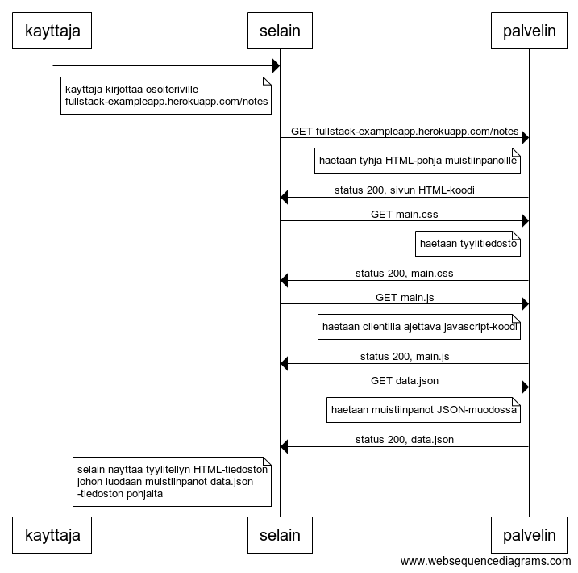
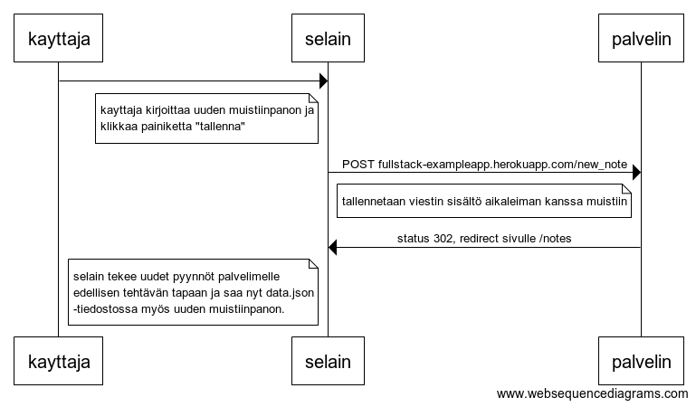
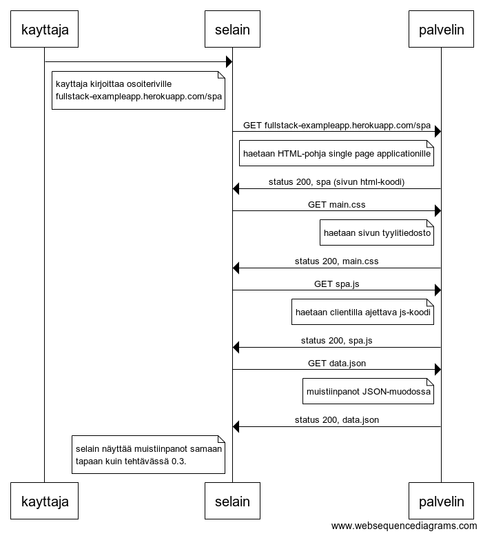
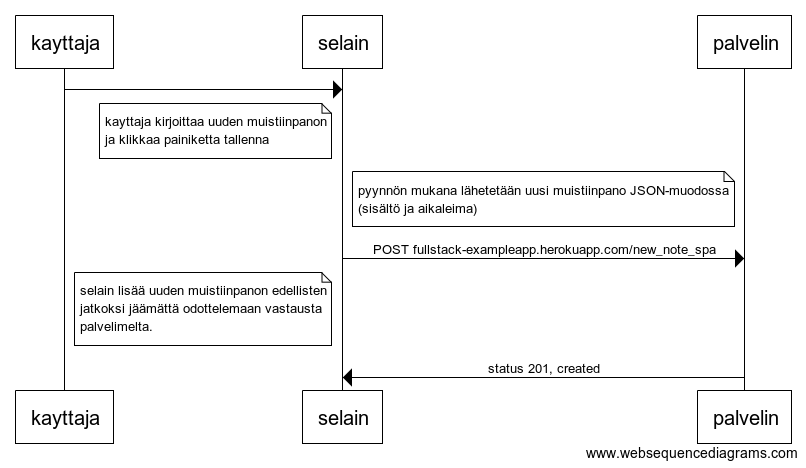

# Osa 0

Kerrattu HTML, CSS ja formit.

## Tehtävä 0.3
Käyttäjä navigoi muistiinpanojen sivulle eli urliin https://fullstack-exampleapp.herokuapp.com/notes:

## Tehtävä 0.4
Käyttäjä luo uuden muistiinpanon ja painaa nappia *tallenna*:

## Tehtävä 0.5
Käyttäjä navigoi SPA-applikaation muistiinpanosivulle eli urliin https://fullstack-exampleapp.herokuapp.com/spa:

## Tehtävä 0.6
Käyttäjä luo uuden muistiinpanon ohjelman SPA-versiossa:
